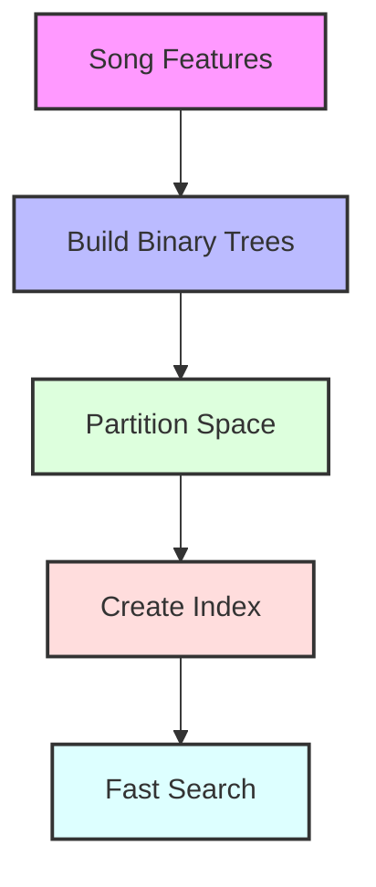

<!-- ---
layout: post
title: Building a Spotify-like Song Recommender using ANNOY
date: 2020-01-01 11:59:00-0400
description: A practical guide to implementing a music recommendation system using Spotify's ANNOY algorithm
categories: recommendation-system machine-learning python
mermaid: true
---

In this tutorial, we'll build a music recommendation system similar to Spotify's using the ANNOY (Approximate Nearest Neighbors Oh Yeah) algorithm. We'll keep it simple and practical, focusing on the core concepts while using real music data.

### What is ANNOY?

ANNOY is an efficient algorithm for approximate nearest neighbor search, developed and open-sourced by Spotify. It's particularly useful when you need to find similar items in large datasets quickly. The "approximate" part means it trades a small amount of accuracy for significant speed gains.

Here's how ANNOY works at a high level:



### Prerequisites

First, let's install the required packages:

```bash
pip install pandas numpy scikit-learn annoy spotipy
```

### Getting the Dataset

We'll use the Spotify Million Song Dataset, but for this tutorial, we'll work with a smaller subset that includes song features like danceability, energy, tempo, etc.

```python
import pandas as pd
import numpy as np
from annoy import AnnoyIndex
from sklearn.preprocessing import StandardScaler
import spotipy
from spotipy.oauth2 import SpotifyClientCredentials

# Load the dataset
df = pd.read_csv('https://raw.githubusercontent.com/rfordatascience/tidytuesday/master/data/2020/2020-01-21/spotify_songs.csv')

# Select relevant features
features = ['danceability', 'energy', 'key', 'loudness', 'mode', 
           'speechiness', 'acousticness', 'instrumentalness', 
           'liveness', 'valence', 'tempo']

# Create feature matrix
X = df[features].values

# Normalize the features
scaler = StandardScaler()
X_scaled = scaler.fit_transform(X)
```

### Building the ANNOY Index

Now, let's implement the ANNOY index for finding similar songs:

```python
def build_annoy_index(data, n_trees=10):
    """
    Build an ANNOY index for quick similarity search
    
    Parameters:
    data: numpy array of feature vectors
    n_trees: number of trees for the ANNOY index (more trees = better accuracy but slower)
    """
    n_features = data.shape[1]
    
    # Initialize ANNOY index
    index = AnnoyIndex(n_features, 'euclidean')
    
    # Add items to the index
    for i in range(len(data)):
        index.add_item(i, data[i])
    
    # Build the index
    index.build(n_trees)
    
    return index

# Build the index
annoy_index = build_annoy_index(X_scaled)
```

### Creating the Recommendation Function

Let's create a function that recommends similar songs:

```python
def get_similar_songs(song_id, index, df, n_recommendations=5):
    """
    Get similar song recommendations
    
    Parameters:
    song_id: index of the song in our dataset
    index: ANNOY index
    df: original dataframe with song information
    n_recommendations: number of recommendations to return
    """
    # Get similar song indices
    similar_song_indices = index.get_nns_by_item(song_id, n_recommendations + 1)[1:]
    
    # Get the similar songs' information
    similar_songs = df.iloc[similar_song_indices][['track_name', 'artist_name', 'genre']]
    
    return similar_songs

# Example usage
song_id = 42  # Example song ID
similar_songs = get_similar_songs(song_id, annoy_index, df)
print(f"Similar songs to '{df.iloc[song_id]['track_name']}' by {df.iloc[song_id]['artist_name']}:")
print(similar_songs)
```

### Making it Interactive

Let's create a simple function to search for songs and get recommendations:

```python
def search_and_recommend(artist_name, track_name, df, annoy_index):
    """
    Search for a song and get recommendations
    """
    # Search for the song
    mask = (df['artist_name'].str.lower() == artist_name.lower()) & \
           (df['track_name'].str.lower() == track_name.lower())
    
    if not mask.any():
        return "Song not found in the dataset"
    
    song_id = df[mask].index[0]
    similar_songs = get_similar_songs(song_id, annoy_index, df)
    
    return similar_songs

# Example usage
recommendations = search_and_recommend("The Weeknd", "Blinding Lights", df, annoy_index)
print(recommendations)
```

### Understanding How It Works

Let's visualize the complete recommendation process:

<pre class="mermaid">
graph LR
    A[Raw Song Data] --> B[Feature Extraction]
    B --> C[Normalization]
    C --> D[ANNOY Index]
    E[Query Song] --> F[Feature Vector]
    F --> G[Search Index]
    D --> G
    G --> H[Similar Songs]
    
    style A fill:#f9f,stroke:#333,stroke-width:2px
    style B fill:#bbf,stroke:#333,stroke-width:2px
    style C fill:#dfd,stroke:#333,stroke-width:2px
    style D fill:#fdd,stroke:#333,stroke-width:2px
    style E fill:#f9f,stroke:#333,stroke-width:2px
    style F fill:#bbf,stroke:#333,stroke-width:2px
    style G fill:#dfd,stroke:#333,stroke-width:2px
    style H fill:#fdd,stroke:#333,stroke-width:2px
</pre>

1. **Feature Selection**: We use audio features that Spotify provides, like danceability, energy, and tempo.
2. **Normalization**: We normalize features to ensure all dimensions contribute equally.
3. **ANNOY Index**: The algorithm builds a forest of binary trees where similar songs end up in the same or nearby leaves.
4. **Similarity Search**: When looking for similar songs, ANNOY traverses these trees to find approximate nearest neighbors quickly.

Here's how the ANNOY tree structure works:

<pre class="mermaid">
graph TD
    A[Root] --> B[Split by Energy]
    B --> C[Split by Danceability]
    B --> D[Split by Danceability]
    C --> E[Similar Songs Group 1]
    C --> F[Similar Songs Group 2]
    D --> G[Similar Songs Group 3]
    D --> H[Similar Songs Group 4]
    
    style A fill:#f96,stroke:#333,stroke-width:2px
    style B fill:#9cf,stroke:#333,stroke-width:2px
    style C fill:#9cf,stroke:#333,stroke-width:2px
    style D fill:#9cf,stroke:#333,stroke-width:2px
    style E fill:#9f9,stroke:#333,stroke-width:2px
    style F fill:#9f9,stroke:#333,stroke-width:2px
    style G fill:#9f9,stroke:#333,stroke-width:2px
    style H fill:#9f9,stroke:#333,stroke-width:2px
</pre>

### Improving the Recommendations

Here's how different components work together in our enhanced recommendation system:

<!-- <div> -->
<pre class="mermaid">
graph TD
    A[Input Song]
    B[Feature Extraction]
    C[Feature Weighting]
    D[Genre Filtering]
    E[ANNOY Search]
    F[Ranked Recommendations]
    
    A --> B
    B --> C & D
    C --> E
    D --> E
    E --> F
    
    classDef default fill:#f9f,stroke:#333,stroke-width:2px;
    classDef process fill:#9cf,stroke:#333,stroke-width:2px;
    classDef filter fill:#9f9,stroke:#333,stroke-width:2px;
    classDef search fill:#ff9,stroke:#333,stroke-width:2px;
    
    class A default;
    class B,C process;
    class D filter;
    class E search;
    class F default;
    
    linkStyle default stroke:#333,stroke-width:2px;
</pre>
<!-- </div> -->

Here are some ways to enhance the recommendations:

1. **Feature Weighting**: Some features might be more important than others:

```python
def weighted_features(X, weights):
    """Apply weights to features"""
    return X * weights.reshape(1, -1)

# Example weights (adjust based on importance)
feature_weights = np.array([1.2, 1.0, 0.8, 1.0, 0.7, 0.9, 1.1, 0.8, 0.7, 1.0, 0.9])
X_weighted = weighted_features(X_scaled, feature_weights)
annoy_index_weighted = build_annoy_index(X_weighted)
```

2. **Genre Filtering**: Add genre-based filtering:

```python
def get_similar_songs_by_genre(song_id, index, df, genre=None, n_recommendations=5):
    """Get similar songs with optional genre filtering"""
    similar_indices = index.get_nns_by_item(song_id, len(df))
    
    if genre:
        # Filter by genre
        genre_mask = df.iloc[similar_indices]['genre'] == genre
        similar_indices = [idx for i, idx in enumerate(similar_indices) if genre_mask.iloc[i]]
    
    return df.iloc[similar_indices[1:n_recommendations+1]]
```

### Performance Considerations

- ANNOY is very memory-efficient as it memory-maps the index file
- The `n_trees` parameter trades off accuracy for speed
- For larger datasets, you might want to save the index to disk:

```python
# Save index
annoy_index.save('spotify_songs.ann')

# Load index
loaded_index = AnnoyIndex(n_features, 'euclidean')
loaded_index.load('spotify_songs.ann')
```

### Conclusion

This implementation gives you a basic but functional music recommendation system similar to Spotify's. While Spotify's actual implementation is much more sophisticated (including collaborative filtering, popularity metrics, and user behavior), this approach demonstrates the core concept of content-based music recommendation using ANNOY.

The complete code is available on [GitHub](your-repository-link). Feel free to experiment with different features, weights, and parameters to improve the recommendations!

---

*Note: This is a simplified version of Spotify's recommendation system. Production systems typically combine multiple approaches and include additional factors like user preferences, listening history, and popularity metrics.* -->